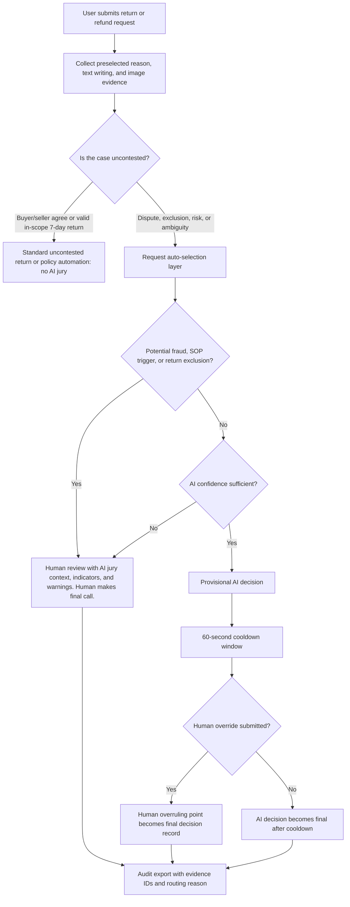

# AI Return Jury MVP Traits

## Approved Routing Principle

The approved MVP flow is the Mermaid flowchart below. The rest of this document should be read as an explanation of that flow, not as a separate design.

The key product principle is simple:

> The AI jury is used only when a return case is disputed, risky, ambiguous, or SOP-sensitive. Uncontested cases should not enter the AI jury pipeline.

This makes the MVP more credible. The platform does not add AI where normal policy automation is enough. AI is reserved for cases where it creates operational value: summarizing messy evidence, detecting risk, explaining uncertainty, and preparing context for human reviewers.

## Routing Flowchart

## Flowchart Node Semantics

| Flow node | Meaning |
| --- | --- |
| User request intake | The case begins with structured request data: preselected reason, buyer text, seller text when available, and image evidence. |
| Uncontested check | The system first asks whether AI is needed at all. Buyer/seller agreement and valid in-scope 7-day returns bypass AI. |
| Standard automation | Uncontested cases follow normal platform return or refund automation. No AI jury is involved. |
| Request auto-selection layer | Contested, excluded, risky, or ambiguous cases enter a triage layer before any AI decision can become final. |
| Fraud, SOP, or exclusion check | Potential fraud, mandatory SOP rules, or return exclusions route to human review. AI can provide context, but humans decide. |
| AI confidence check | If no hard escalation trigger exists, the AI jury may recommend a provisional decision only when confidence is high enough. |
| Provisional AI decision | The AI decision is temporary and waits through a 60-second cooldown. |
| Human override | During cooldown, a human reviewer can override and write the overruling point. |
| Audit export | Every final path produces a traceable record with evidence IDs, routing reason, and decision context. |

## Uncontested Cases

Uncontested cases are outside the AI jury's scope.

| Case condition | Route | AI involvement |
| --- | --- | --- |
| Buyer and seller agree on refund, return, or exchange | Standard uncontested return flow | No AI jury needed. |
| Valid in-scope 7-day no-reason return | Standard policy automation | No AI jury needed unless fraud, exclusion, or abnormal history is detected. |

The first product question is therefore:

> Does this case need AI at all?

If the answer is no, the case should be handled by standard platform rules. This avoids black-box behavior in simple cases and shows that the system is designed for operational judgment, not AI for AI's sake.

## Contested Case Intake

Cases enter the AI-supported flow only when there is a dispute, exclusion, risk signal, ambiguity, or SOP sensitivity.

The intake layer should collect:

| Evidence input | Intended support |
| --- | --- |
| Preselected request options | User-selected reason codes, such as "do not want anymore," product description mismatch, material mismatch, size mismatch, production date or warranty mismatch, color/style/model mismatch, quality issue, missing item or accessory, damaged item, or dirty item. |
| Buyer text box | Buyer claim, timeline, requested resolution, and explanation for uploaded evidence. |
| Seller text box | Seller response, policy argument, warehouse notes, and explanation for uploaded evidence. |
| Buyer image upload | Product photos, packaging photos, labels, screenshots, or chat screenshots. |
| Seller image upload | Packing proof, outbound inspection photos, listing screenshots, warehouse records, or return-inspection photos. |
| Reviewer notes | Internal operator notes separated from buyer/seller evidence. |

The preselected reason code should be considered together with written text and images. A selected reason like "quality issue" is useful structure, but it is not proof by itself.

## Auto-Selection Layer

After uncontested cases are bypassed, the auto-selection layer routes the remaining cases.

| Condition | Route | Explanation shown to reviewer |
| --- | --- | --- |
| Potential fraud, manipulation, abnormal history, contradictory evidence, or prompt-injection language | Human review | AI jury supplies indicators, warnings, cited evidence IDs, and a concise risk summary. Human makes the final call. |
| Mandatory SOP trigger or return exclusion | Human review | AI jury summarizes the case and names the SOP or exclusion reason. Human makes the final call. |
| AI confidence is not sufficient | Human review | AI jury explains why the case needs human review, such as weak evidence, narrow vote margin, missing seller proof, or conflicting narratives. |
| AI confidence is sufficient and no hard escalation trigger applies | Provisional AI decision | AI recommends a decision, then starts a 60-second cooldown window for human override. |

The routing rule can be summarized as:

\[
\operatorname{route}(x) =
\begin{cases}
\text{Standard automation}, & U(x) = 1 \\
\text{Human review}, & F(x) = 1 \lor S(x) = 1 \lor C(x) < \tau \\
\text{Provisional AI decision}, & C(x) \geq \tau \land F(x) = 0 \land S(x) = 0
\end{cases}
\]

Where \( U(x) \) means the case is uncontested, \( F(x) \) means fraud or manipulation is suspected, \( S(x) \) means a mandatory SOP or exclusion applies, \( C(x) \) is AI confidence, and \( \tau \) is the confidence threshold.

## AI Jury Role

The AI jury is not the final authority for risky cases. Its job is to prepare structured reasoning.

| Agent role | Purpose in the approved flow |
| --- | --- |
| Policy Judge | Checks policy fit, return exclusions, and SOP triggers. |
| Buyer Advocate | Evaluates whether the buyer claim is plausible and fairly supported. |
| Seller Advocate | Checks seller fairness, weak evidence, and abusive return patterns. |
| Evidence & Injection Sentinel | Treats buyer/seller content as untrusted evidence and flags prompt-injection or manipulation. |
| Packaging & Logistics Agent | Reviews packaging, delivery records, and chain-of-custody issues. |
| Fraud Risk Agent | Looks for repeated abnormal claims, contradictory evidence, and suspicious behavior. |
| Human Escalation Agent | Decides whether automation should stop and a human should review. |

The AI jury should cite evidence IDs, explain disagreement, and produce warning indicators. It should not silently override platform policy or human judgment.

## Provisional AI Decision and Cooldown

The only AI-decision path in the approved flow is provisional.

It is allowed only when:

1. The case is not uncontested.
2. No fraud, SOP trigger, or return exclusion is detected.
3. The AI confidence is sufficient.
4. Evidence is strong enough and the vote margin is not narrow.

For the demo, the cooldown is 60 seconds. During cooldown, a human reviewer can add an overruling point. If no human override is submitted, the AI decision becomes final after the cooldown.

This gives the platform efficiency without pretending that every decision is safely automated.

## Human Review Path

All human-review cases should be shown in one consolidated path:

> Human review with AI jury context, indicators, and warnings. Human makes final call.

This path receives cases from fraud signals, SOP triggers, return exclusions, and low AI confidence. The AI jury helps by summarizing evidence and naming the risk, but the reviewer is responsible for the final decision.

## Explainability and Audit Trail

Every branch should produce an auditable record.

| Requirement | Documentation goal |
| --- | --- |
| Evidence traceability | Agent opinions cite evidence IDs rather than vague summaries. |
| Routing traceability | The final export shows whether the case bypassed AI, went to human review, or became a provisional AI decision. |
| Warning traceability | Fraud, SOP, exclusion, and low-confidence reasons are shown explicitly. |
| Human override trace | If a reviewer overrides during cooldown, the record includes the overruling point. |
| Reproducibility | Mock mode should produce deterministic outputs for the same case input. |
| Audit export | Exported JSON includes case input, evidence list, routing path, agent opinions, verdict, and mode. |

The judge-facing message is:

> The system does not ask the platform to trust a black box. It shows why AI was used, why AI was skipped, or why a human must decide.

## MVP Scope

| Area | Current MVP stance |
| --- | --- |
| Uncontested return handling | Defined as a no-AI bypass in the approved flow. |
| AI jury | Used only for contested, risky, ambiguous, or SOP-sensitive cases. |
| Human review | Required for fraud, SOP triggers, return exclusions, or low confidence. |
| Provisional AI decision | Allowed only after hard escalation triggers are cleared and confidence is sufficient. |
| Cooldown | Demo uses 60 seconds for human override. |
| Export | Used to show routing, evidence IDs, AI comments, and final decision context. |

## Not Supported Yet

| Gap | Current limitation |
| --- | --- |
| Real return automation | Standard uncontested return flow is documented but not integrated with a live commerce backend. |
| Persistent human review queue | There is no database-backed reviewer queue, assignment, or status history yet. |
| Full evidence forensics | The MVP does not yet perform OCR, barcode reading, serial matching, video frame extraction, or metadata inspection. |
| Real workflow execution | Recommended actions do not call refund, notification, logistics, seller-risk, or CRM systems. |
| Production hardening | Authentication, rate limiting, upload limits, audit permissions, and observability still need production design. |

## Demo Storyline

1. Show an uncontested case bypassing the AI jury.
2. Show a valid in-scope 7-day return using standard policy automation.
3. Show a contested case entering the request auto-selection layer.
4. Show fraud/SOP/return-exclusion signals routing to one human-review node with AI context and warnings.
5. Show a high-confidence case receiving a provisional AI decision.
6. Show the 60-second cooldown and optional human override.
7. Export the audit record with evidence IDs and routing reason.

## Best Next Increments

| Priority | Increment | Why it matters |
| --- | --- | --- |
| 1 | Implement uncontested bypass in the UI | Judges can see that AI is avoided when normal policy automation is enough. |
| 2 | Add preselected reason options | The intake matches real return flows and gives the AI structured context. |
| 3 | Add buyer/seller custom evidence panels | Text and image evidence from both sides can be labeled as untrusted evidence. |
| 4 | Add auto-selection routing UI | The dashboard can show bypass, human review, or provisional AI decision paths. |
| 5 | Add cooldown override UI | Human reviewers can overrule provisional AI decisions during the 60-second window. |
| 6 | Add audit export fields | Export should include routing reason, evidence IDs, warnings, and override notes. |

## Repo Hygiene

Generated runtime files should stay out of version control: `.next/`, `node_modules/`, build outputs, coverage, test reports, local env files, and generated skill exports. `next-env.d.ts` remains tracked because Next.js projects commonly use it as part of the TypeScript project surface.
