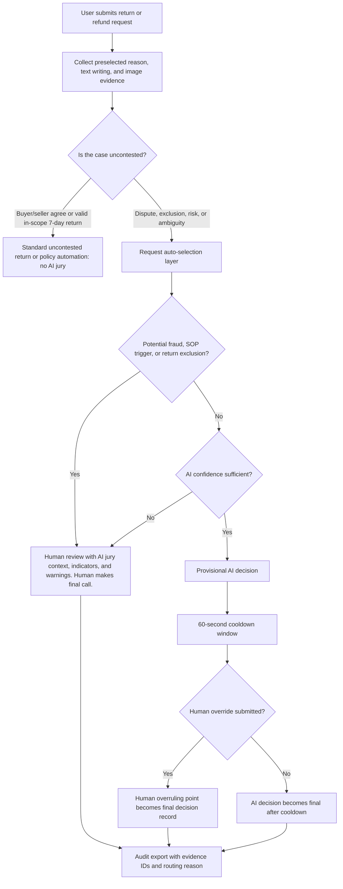

# AI Return Jury MVP Traits

## MVP Positioning

This MVP is a hackathon-ready product demo for marketplace return dispute operations. It shows how a case can move from structured intake to a multi-agent jury, then into a confidence-aware verdict with escalation logic.

The demo should be presented as an operational decision-support system, not as a fully automated marketplace backend. Its strongest current story is transparency: each agent votes, cites evidence IDs, names risks, and contributes to a final verdict.

## Supported in the Current MVP

| Trait | Current behavior |
| --- | --- |
| Case intake | Loads preset dispute cases and lets the user edit buyer and seller narratives. |
| Evidence board | Displays text, policy, logistics, history, and image evidence summaries. |
| Image upload | Accepts local image evidence in the browser and includes it in the case payload. |
| Multi-agent panel | Runs seven specialized jury roles: policy, buyer, seller, evidence/injection, packaging/logistics, fraud risk, and human escalation. |
| Mock jury mode | Produces deterministic outputs when no OpenAI API key is available, making the demo reliable offline or under API failure. |
| Live jury mode | Uses the OpenAI Responses API when `OPENAI_API_KEY` is configured. |
| Structured output | Validates case input and agent verdict shapes with Zod schemas. |
| Prompt-injection handling | Treats buyer and seller text as evidence, detects instruction-like manipulation, and escalates risky cases. |
| Verdict scoring | Computes vote split, confidence, risk score, responsibility split, escalation reasons, and recommended actions. |
| Export | Downloads the current case and verdict as JSON for audit or review handoff. |

## Not Supported Yet

| Gap | Current limitation |
| --- | --- |
| True deliberation rounds | Agents do not yet read each other's opinions and revise their votes. The foreperson summarizes the first-round opinions. |
| Knowledge retrieval | Policies and histories are supplied directly in the case instead of being retrieved from a policy or precedent database. |
| Persistent operations | There is no database, saved case queue, reviewer assignment, login, role permissions, or audit-history storage. |
| Real workflow execution | Recommended actions do not call refund, notification, seller-risk, logistics, or CRM systems. |
| Full evidence forensics | The MVP does not perform OCR, barcode reading, serial-number matching, video frame extraction, metadata inspection, or fake-evidence detection. |
| Broad custom case authoring | The UI edits the narratives and uploads images, but most structured fields still come from preset cases. |
| Production hardening | Rate limiting, upload size limits, authentication, observability, and deployment secrets policy still need to be added before production use. |

## Scoring Trait

The MVP's verdict confidence is intentionally explainable. It combines average agent confidence, vote margin, evidence strength, and maximum risk:

\[
C = \operatorname{clamp}(0.45\bar{c} + 0.35m + 0.20\bar{e} - 0.25r)
\]

Where \( \bar{c} \) is average agent confidence, \( m \) is normalized vote margin, \( \bar{e} \) is average evidence strength, and \( r \) is the highest risk score across agents.

Escalation is triggered when confidence is low, vote margin is narrow, risk is high, prompt injection is detected, or the order value exceeds the high-value threshold.

## Credibility and Human Escalation Stance

The MVP should not present the score as an oracle. The formula is a triage signal that helps rank confidence, risk, and operational urgency, but it should never be treated as the sole source of truth for financially sensitive, policy-sensitive, or fraud-sensitive cases.

The platform goal is to reduce unnecessary human workload, not to pretend full automation is already safe. The credible stance is:

1. Automate only clear, low-risk, low-value cases where evidence is strong and the vote margin is decisive.
2. Escalate cases that are high-value, narrow-margin, policy-restricted, fraud-sensitive, or covered by a mandatory SOP.
3. Preserve a complete reasoning trail so the human reviewer can understand why the system reached its recommendation.

For the hackathon demo, at least one hardcoded SOP escalation rule should be shown directly in the system. A practical example is:

> If the item is high-value, hygiene-sensitive, customized, regulated, or has a suspected evidence-manipulation signal, the system must require human confirmation before final action.

This makes the demo more defensible. It shows that the system recognizes automation boundaries instead of blindly optimizing for fewer human reviewers.

## Conservative Automation Threshold

The score should intentionally lean toward human involvement as order value and case risk increase. In practice, the confidence threshold for automatic resolution should be narrow: only cases with strong evidence, low risk, and a clear vote margin should pass.

A simple demo framing is:

\[
\operatorname{autoResolve} =
\begin{cases}
\text{true}, & C \geq \tau \land r < r_{\max} \land v \geq v_{\min} \land \neg S \\
\text{false}, & \text{otherwise}
\end{cases}
\]

Where \( C \) is confidence, \( \tau \) is the auto-resolution threshold, \( r \) is risk, \( v \) is vote margin, and \( S \) means an SOP escalation rule applies.

As item value increases, \( \tau \) should effectively become harder to satisfy. This reflects the real platform trade-off: human review is expensive, but mistaken automation on high-value or sensitive cases is more expensive.

## Uncontested Case Bypass

The AI jury is only needed for disputed, risky, ambiguous, or SOP-sensitive cases. Not every return should enter the AI pipeline.

If the buyer and seller already agree on the resolution, or if the buyer exercises a valid in-scope 7-day no-reason return that is not covered by a 7-day return exclusion, the case should be treated as uncontested. Uncontested cases should follow the platform's normal automated return flow without AI jury involvement.

This keeps the MVP credible and operationally efficient. The system does not add AI where simple policy execution is enough.

| Case condition | Route | AI involvement |
| --- | --- | --- |
| Buyer and seller agree on refund, return, or exchange | Standard uncontested return flow | No AI jury needed. |
| Valid in-scope 7-day no-reason return | Standard policy automation | No AI jury needed unless fraud, exclusion, or abnormal history is detected. |
| 7-day return exclusion applies | Disputed or SOP-sensitive flow | AI may summarize, but human review may still be required. |
| Seller contests buyer claim | Request auto-selection layer | AI jury or human review depending on risk and confidence. Human review may still be required. |
| Buyer evidence and seller evidence conflict | Request auto-selection layer | AI jury evaluates evidence and may escalate. Human review may still be required. |
| Potential fraud or manipulation appears | Human review | AI jury provides warning comments and cited fraud indicators. |

The first decision is therefore not "What should AI decide?" but "Does this case need AI at all?"

## Routing Flowchart

## Request Auto-Selection Layer

When the user submits a return or refund request, the first system step should be an auto-selection layer. This layer decides whether the request can enter a fast AI decision path or must be routed to human review.

After uncontested cases are bypassed, the routing for remaining contested cases should be simple enough to explain in the demo:

| Auto-selection outcome | Route | System explanation |
| --- | --- | --- |
| Potential fraud | Human review | AI jury attaches a warning with specific potential fraud indicators, such as repeated abnormal claims, contradictory evidence, suspicious images, coercive text, or prompt-injection language. |
| AI confidence is sufficient | Provisional AI decision | AI recommends a decision, then starts a short cooldown window. For the demo, use 60 seconds. During this period, a human reviewer can override or add an overruling point before the decision becomes final. |
| AI confidence is insufficient | Human review | AI jury comments explain the exact reason human review is needed, such as weak evidence, narrow vote margin, missing seller proof, high item value, SOP restriction, or conflicting buyer/seller narratives. |

This creates a more believable workflow than instant automation. AI handles the quick summary trial for clear cases, but the platform still keeps human authority for fraud, uncertainty, and policy-sensitive cases.

The routing rule can be framed as:

\[
\operatorname{route}(x) =
\begin{cases}
\text{Human review with fraud warning}, & F(x) = 1 \\
\text{Provisional AI decision with cooldown}, & C(x) \geq \tau \land S(x) = 0 \land F(x) = 0 \\
\text{Human review with AI explanation}, & C(x) < \tau \lor S(x) = 1
\end{cases}
\]

Where \( F(x) \) is the potential-fraud flag, \( C(x) \) is the AI confidence score, \( \tau \) is the confidence threshold, and \( S(x) \) is a mandatory SOP escalation flag.

## Operational Analogy

The demo can use a legal-system analogy to explain the product:

| Analogy | Product meaning |
| --- | --- |
| AI summary trial | The AI jury performs fast, structured first-pass reasoning for routine cases. |
| Human general court-martial | Human review handles serious, disputed, high-value, fraud-sensitive, or SOP-bound cases. |
| Web dashboard | The dashboard is the case-management system where evidence, jury comments, escalation reasons, cooldown status, and human overrides are visible. |

This analogy should be used carefully. The message is not that the platform is punishing users; the message is that different levels of seriousness require different levels of review authority.

## Custom Evidence Intake Target

The MVP should support richer custom evidence input from both buyer and seller:

| Evidence input | Intended support |
| --- | --- |
| Preselected request options | User-selected reason codes, such as "do not want anymore," product description mismatch, material mismatch, size mismatch, production date or warranty mismatch, color/style/model mismatch, quality issue, missing item or accessory, damaged item, or dirty item. |
| Buyer text box | Buyer claim, timeline, requested resolution, and optional explanation for uploaded evidence. |
| Seller text box | Seller response, policy argument, warehouse notes, and optional explanation for uploaded evidence. |
| Buyer image upload | Product photos, packaging photos, labels, screenshots, or chat screenshots. |
| Seller image upload | Packing proof, outbound inspection photos, product listing screenshots, warehouse records, or return-inspection photos. |
| Reviewer notes | Internal notes that are separated from buyer/seller evidence and treated as trusted operator context only when explicitly marked. |

The user's preselected request options should be considered together with free-text writing and uploaded images. A selected reason code is useful structure, but it is not proof by itself. For example, "quality issue" should be checked against photos, chat history, product category, seller response, and prior behavior before the AI jury reaches a recommendation.

All custom uploads should be displayed with evidence IDs, source labels, timestamps when available, selected reason codes, and a short human-readable summary. This helps the jury cite evidence precisely instead of producing vague reasoning.

## Fraud and Manipulation Guardrails

Buyer and seller submissions must be treated as untrusted evidence. They may contain honest claims, incomplete information, adversarial framing, fake photos, staged screenshots, or prompt-injection attempts.

Guardrails for the MVP narrative:

1. Separate platform policy and SOP text from buyer/seller-submitted text.
2. Label every evidence item by source: buyer, seller, logistics, policy, history, or reviewer.
3. Ask agents to cite evidence IDs rather than obey claims.
4. Route prompt-injection or instruction-like language to the Evidence & Injection Sentinel.
5. Escalate when user-submitted evidence is contradictory, emotionally coercive, or likely manipulated.
6. Preserve the original submitted content for audit instead of overwriting it with model summaries.

This directly addresses fraud risk from both sides. The buyer may submit misleading evidence to force a refund; the seller may submit selective records to block a valid return. The system's job is to compare evidence, not to trust either party by default.

## Explainability, Traceability, and Reproducibility

To reduce black-box behavior, each verdict should expose the path from evidence to decision:

| Requirement | Documentation goal |
| --- | --- |
| Evidence traceability | Every agent opinion should cite evidence IDs, not just summarize the case. |
| Vote transparency | The final verdict should show vote counts and vote margin. |
| Score explainability | The verdict should show confidence, risk, evidence strength, and escalation reasons separately. |
| SOP visibility | Mandatory escalation rules should be visible in the verdict when they apply. |
| Routing traceability | The system should show whether the case went to fraud review, provisional AI decision with cooldown, or ordinary human review. |
| Human override trace | If a reviewer overrides during the cooldown window, the exported audit record should include who overrode, when they overrode, and the written overruling point. |
| Reproducibility | Mock mode should produce deterministic results for the same case input. |
| Audit export | Exported JSON should include case input, evidence list, agent opinions, deliberation, verdict, and mode. |

The desired judge-facing message is simple: the system does not ask the platform to trust a black box. It produces a structured, reproducible recommendation with named evidence, named dissent, and explicit reasons for human involvement.

## Demo-Ready Storyline

1. Start with the wrong-item case to show a decisive buyer-protective resolution.
2. Switch to the damaged-delivery case to show split responsibility between seller packaging and logistics handling.
3. Switch to the opened-cosmetic case to show policy restriction, repeated buyer risk, and prompt-injection escalation.
4. Upload a local image to demonstrate that the evidence board can accept new visual evidence.
5. Show a hardcoded SOP escalation rule, such as high-value or hygiene-sensitive manual confirmation.
6. Show the auto-selection layer routing the case into fraud review, provisional AI decision with 60-second cooldown, or human review with explanation.
7. Export the verdict JSON to show auditability and reviewer handoff.

## Best Next Increments

| Priority | Increment | Why it matters |
| --- | --- | --- |
| 1 | Add visible first-round and second-round deliberation | This makes the "jury" concept feel real instead of parallel single-pass judging. |
| 2 | Add buyer/seller custom evidence panels | Each side can submit text and images, while the system labels all submissions as untrusted evidence. |
| 3 | Add preselected reason options | The AI can consider structured request reasons alongside text and image evidence. |
| 4 | Add auto-selection routing | Cases visibly route to fraud review, provisional AI decision with cooldown, or human review with AI explanation. |
| 5 | Add visible SOP escalation rules | This increases credibility by showing when automation is deliberately blocked. |
| 6 | Expand editable case fields | Judges can perturb order value, return type, policy, logistics, and histories during the demo. |
| 7 | Add an evidence-extraction step | A lightweight model pass can produce captions, OCR text, damage notes, and cited observations. |
| 8 | Add a human-review queue | This turns the demo from a verdict screen into a miniature operations console. |
| 9 | Add API fallback tests | The mock fallback is important to demo reliability and should be protected by tests. |

## Repo Hygiene

Generated runtime files should stay out of version control: `.next/`, `node_modules/`, build outputs, coverage, test reports, local env files, and generated skill exports. `next-env.d.ts` remains tracked because Next.js projects commonly use it as part of the TypeScript project surface.
